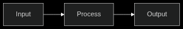
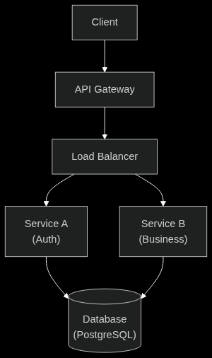
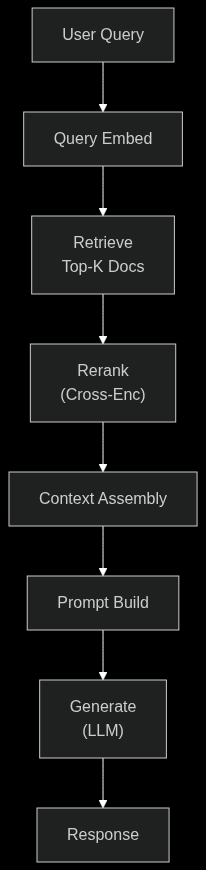

# ASCII 2 Canvas

Convert text-based diagrams into polished PNG images using Mermaid JS.

```
Mermaid .txt ──► config.json ──► main.py ──► PNG
```

## Installation

```bash
pip install -r requirements.txt
playwright install chromium
```

## Usage

1. Write diagrams in Mermaid syntax inside `.txt` files under `examples/`
2. List them in `config.json`
3. Run:

```bash
python main.py
```

Output PNGs appear in `outputs/` with matching filenames.

## Config

```json
{
  "theme": "dark",
  "input_dir": "examples",
  "output_dir": "outputs",
  "files": [
    "pipeline.txt",
    "architecture.txt",
    "rag_flow.txt"
  ]
}
```

## Examples

### pipeline.txt

```
flowchart LR
    Input --> Process --> Output
```



---

### architecture.txt

```
flowchart TD
    Client["Client"] --> API["API Gateway"]
    API --> LB["Load Balancer"]
    LB --> SA["Service A<br/>(Auth)"]
    LB --> SB["Service B<br/>(Business)"]
    SA --> DB[("Database<br/>(PostgreSQL)")]
    SB --> DB
```



---

### rag_flow.txt

```
flowchart TD
    Q["User Query"] --> QE["Query Embed"]
    QE --> R["Retrieve<br/>Top-K Docs"]
    R --> RK["Rerank<br/>(Cross-Enc)"]
    RK --> CA["Context Assembly"]
    CA --> PB["Prompt Build"]
    PB --> G["Generate<br/>(LLM)"]
    G --> Resp["Response"]
```



## Features

- Renders with Mermaid JS (flowcharts, sequence diagrams, etc.)
- Dark & light themes
- Clean PNG output
- Auto-sized canvas

## Project Structure

```
├── config.json
├── main.py
├── requirements.txt
├── examples/
│   ├── pipeline.txt
│   ├── architecture.txt
│   └── rag_flow.txt
├── outputs/
└── src/
    ├── config_loader.py
    ├── parser.py
    ├── renderer.py
    └── themes.py
```

## Requirements

- Python 3.10+
- Playwright + Chromium
